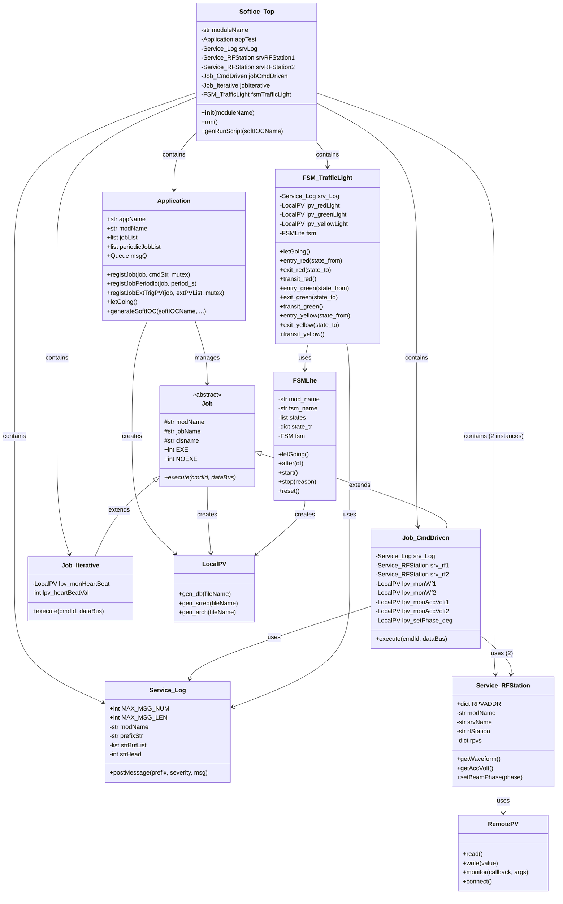
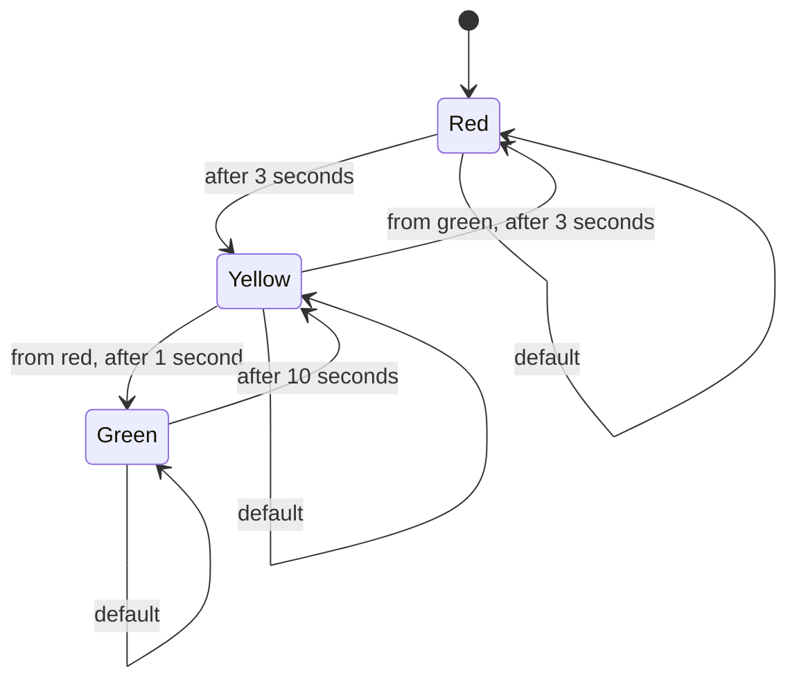
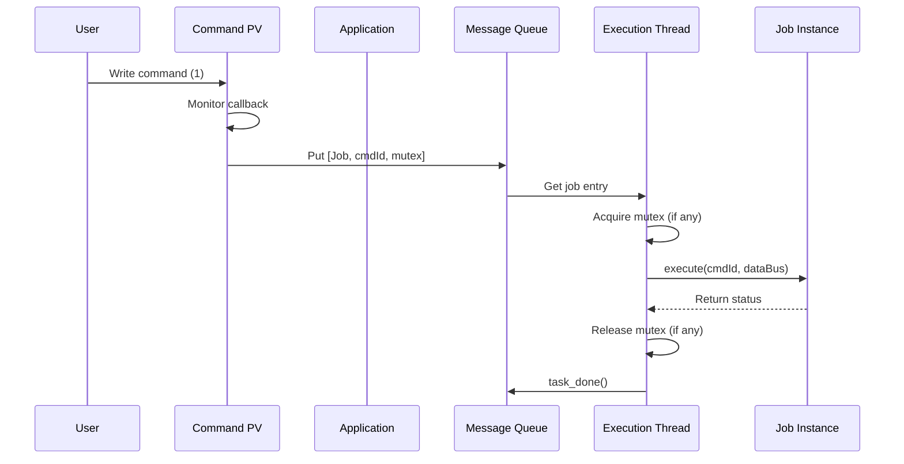

# ooEpicsPy Example Documentation

## Table of Contents
1. [Overview](#overview)
2. [Architecture](#architecture)
3. [Class Diagrams](#class-diagrams)
4. [Detailed Class Documentation](#detailed-class-documentation)
5. [Method Reference](#method-reference)
6. [Usage Examples](#usage-examples)

---

## Overview

The ooEpicsPy/example demonstrates an object-oriented framework for creating EPICS (Experimental Physics and Industrial Control System) Soft IOCs (Input/Output Controllers) using Python. The framework provides a structured approach to building control systems with:

- **Jobs**: Executable tasks that can be triggered by commands or run periodically
- **Finite State Machines (FSM)**: State-driven control logic
- **Services**: Reusable components for external system interaction
- **Applications**: Coordinators that manage jobs and FSMs
- **Local/Remote PVs**: EPICS Process Variables for data exchange

---

## Architecture

### Component Hierarchy

```
SoftIOC Top (Main Container)
├── Application (Coordinator)
│   ├── Job_CmdDriven (Command-driven job)
│   └── Job_Iterative (Periodic job)
├── FSM_TrafficLight (State machine)
├── Service_Log (Logging service)
└── Service_RFStation (RF station interface)
    ├── Service_RFStation1
    └── Service_RFStation2
```

---

## Class Diagrams

### 1. Main Class Relationships



### 2. FSM State Transition Diagram



### 3. Job Execution Flow



---

## Detailed Class Documentation

### 1. Softioc_Top

**Purpose**: Top-level container class that assembles and coordinates all components of the Soft IOC.

**Responsibilities**:
- Initialize and configure all components (Application, Jobs, FSMs, Services)
- Register jobs with the application
- Generate runtime scripts
- Start all execution threads

**Key Attributes**:
- `moduleName`: Base name used for constructing EPICS PV names
- `appTest`: Application coordinator instance
- `srvLog`: Logging service instance
- `srvRFStation1`, `srvRFStation2`: RF station service instances
- `jobCmdDriven`, `jobIterative`: Job instances
- `fsmTrafficLight`: Finite state machine instance

---

### 2. Application (ooepics/Application.py)

**Purpose**: Thread-based coordinator that manages job execution and command processing.

**Key Features**:
- Manages a message queue for job execution
- Supports command-driven jobs (triggered by PV changes)
- Supports periodic jobs (executed at fixed intervals)
- Thread-safe execution with optional mutex locking

**Class Variables**:
- `softIOCName`: Name of the Soft IOC
- `appList`: List of all Application instances

**Key Methods**:
- `registJob(job, cmdStr, mutex)`: Register a command-driven job
- `registJobPeriodic(job, period_s)`: Register a periodically executed job
- `registJobExtTrigPV(job, extPVList, mutex)`: Register job with external trigger PV
- `letGoing()`: Start the execution thread and timers
- `generateSoftIOC(softIOCName, ...)`: Generate Soft IOC configuration files

**Execution Flow**:
1. Command PV changes trigger callback
2. Callback puts job entry into message queue
3. Execution thread retrieves job from queue
4. Job's execute() method is called
5. Optional mutex ensures thread safety

---

### 3. Job (ooepics/Job.py)

**Purpose**: Abstract base class for all executable tasks in the system.

**Class Variables**:
- `EXE`: Execute flag (0)
- `NOEXE`: No execution flag (1)

**Protected Attributes**:
- `modName`: Module name for PV construction
- `jobName`: Job name for PV construction
- `clsname`: Derived class name

**Key Methods**:
- `execute(cmdId, dataBus)`: Execute the job (must be implemented in derived classes)
  - `cmdId`: Command identifier for different commands
  - `dataBus`: Data bus for passing information between jobs
  - Returns: Boolean indicating success status

**Usage Pattern**:
```python
class MyJob(Job):
    def __init__(self, modName, jobName):
        Job.__init__(self, modName, jobName)
        # Initialize local PVs and other resources
    
    def execute(self, cmdId, dataBus):
        # Implement job logic
        # cmdId: 0-N for different commands
        # dataBus: Optional data structure
        return True   # or False on failure
```

---

### 4. Job_CmdDriven

**Purpose**: Example job that responds to three different commands for RF station control.

**Commands**:
- **0 - GET-WAVEFORM**: Read waveforms from both RF stations
- **1 - COMPARE-ACC-VOLT**: Compare acceleration voltages between stations
- **2 - SET-PHASE-SP**: Set beam phase to both stations

**Key Attributes**:
- `srv_Log`: Logging service for messages
- `srv_rf1`, `srv_rf2`: RF station services (2 instances)
- `lpv_monWf1`, `lpv_monWf2`: Waveform display PVs (2048 samples)
- `lpv_monWfTime`: Time axis PV (2048 samples, microseconds)
- `lpv_monAccVolt1`, `lpv_monAccVolt2`: Acceleration voltage PVs (MV)
- `lpv_monLarger`: Comparison result (0=Station 1, 1=Station 2, 2=Equal)
- `lpv_setPhase_deg`: Phase setpoint (degrees)

**Method Details**:

##### execute(cmdId, dataBus)
**Purpose**: Execute job based on command ID

**Parameters**:
- `cmdId`: Command identifier (0, 1, or 2)
- `dataBus`: Data bus (unused in this implementation)

**Behavior**:
- **cmdId=0 (GET-WAVEFORM)**:
  - Calls `getWaveform()` on both RF stations
  - Writes waveform data to local PVs
  - Handles partial success cases
  - Logs appropriate messages
  
- **cmdId=1 (COMPARE-ACC-VOLT)**:
  - Reads acceleration voltages from both stations
  - Compares values and writes result to `lpv_monLarger`
  - 0 = Station 1 larger, 1 = Station 2 larger, 2 = Equal
  
- **cmdId=2 (SET-PHASE-SP)**:
  - Reads phase setpoint from `lpv_setPhase_deg`
  - Sets phase on both RF stations
  - Handles partial success cases

**Returns**: `[dataBus, success_flag]`

**Error Handling**:
- Validates RF station services
- Checks PV read/write status
- Logs warnings for partial successes
- Logs errors for failures

---

### 5. Job_Iterative

**Purpose**: Simple example of a periodically executed job that toggles a heartbeat signal.

**Key Attributes**:
- `lpv_monHeartBeat`: Binary indicator PV (toggle 0/1)
- `lpv_heartBeatVal`: Internal counter value

**Method Details**:

##### execute(cmdId, dataBus)
**Purpose**: Execute heartbeat toggle

**Behavior**:
- Toggles `lpv_heartBeatVal` between 0 and 1
- Writes current value to `lpv_monHeartBeat` PV

**Usage**: Typically registered with `registJobPeriodic(job, period_s)` where period_s=1 second

---

### 6. FSMLite (ooepics/FSMLite.py)

**Purpose**: Lightweight finite state machine framework with thread-safe execution.

**Key Features**:
- Timer-driven state transitions
- Entry/exit/transition callbacks for each state
- Retry mechanism with configurable max attempts
- Message queue for thread communication
- State monitoring via EPICS PVs

**Constructor Parameters**:
- `mod_name`: Module name for PV construction
- `fsm_name`: FSM name for PV construction
- `timer_intv`: Timer interval in seconds (default: 1, range: 0.01-10)
- `max_try`: Maximum retry attempts (default: 3)
- `states`: List of state names (strings)
- `state_tr`: State transition table (dict)
- `mon_func`: Optional monitoring function when FSM is idle

**State Transition Table Format**:
```python
state_tr = {
    'state_name': {
        'entry': entry_function,   # Called when entering state
        'exit': exit_function,     # Called when leaving state
        'transit': transit_function # Called periodically, returns next state
    }
}
```

**Key Attributes**:
- `current_state`: Currently active state
- `next_state`: State to transition to
- `last_state`: Previous state
- `entry_time`: Timestamp when current state was entered
- `stay_time`: Time elapsed in current state
- `try_cnt_entry`, `try_cnt_trans`, `try_cnt_exit`: Retry counters
- `timer`: RepeatedTimer instance
- `fsm_running`: Boolean flag

**Local PVs**:
- `CMD-START`, `CMD-STOP`, `CMD-RESET`: Control commands
- `MAX-TRY`: Maximum retry attempts (settable)
- `CUR-STATE`: Current state name (text)
- `FSM-MSG`: FSM messages (text)
- `STAY-TIME`: Time in current state (seconds)
- `ENTRY-OK`, `TRANS-OK`, `EXIT-OK`: Success flags
- `RUNNING`: FSM running status

**Key Methods**:

##### letGoing()
**Purpose**: Start FSM execution thread and monitors

**Behavior**:
- Creates daemon thread for FSM execution
- Monitors command PVs (START, STOP, RESET)
- Posts start message

##### start()
**Purpose**: Start/resume FSM execution

**Behavior**:
- Resets retry counters
- Starts timer
- Sets `fsm_running = True`
- Sends status message to thread

##### stop(reason)
**Purpose**: Stop FSM execution

**Parameters**:
- `reason`: Stop reason ('user command' or state function failure)

**Behavior**:
- Stops timer
- Sets `fsm_running = False`
- Logs stop reason

##### reset()
**Purpose**: Reset FSM to initial state

**Behavior**:
- Resets state to first state in list
- Resets timers and counters
- Resets entry time

##### after(dt)
**Purpose**: Check if specified time has elapsed in current state

**Parameters**:
- `dt`: Time to check in seconds

**Returns**: Boolean (True if `dt` seconds have passed)

##### init_state(state_ini)
**Purpose**: Set initial state (different from default first state)

**Parameters**:
- `state_ini`: State name to set as initial

**Behavior**:
- Validates state exists in state list
- Resets FSM and sets to specified state

**Thread Communication**:
- Uses message queue to avoid pyEpics callback loops
- Timer callbacks send empty messages to queue
- Command callbacks send status messages to queue
- Thread processes messages and executes FSM logic

**FSM Execution Cycle**:
1. Check if new state entered
2. If yes, execute entry() function
3. Update stay_time
4. Execute transit() function to determine next state
5. If state change needed, execute exit() function
6. Update current_state
7. Repeat

---

### 7. FSM_TrafficLight

**Purpose**: Example FSM implementing a traffic light control sequence.

**States**:
- **red**: Red light on for 3 seconds
- **green**: Green light on for 10 seconds
- **yellow**: Yellow light on for 1 or 3 seconds depending on previous state

**Key Attributes**:
- `srv_Log`: Logging service
- `lpv_redLight`, `lpv_greenLight`, `lpv_yellowLight`: Light control PVs (binary)
- `fsm`: FSMLite instance
- `come_from`: Internal variable to track previous state (used by yellow)

**State Functions**:

#### State: red
**entry_red(state_from)**:
- Turn red light ON
- Turn green and yellow lights OFF
- Log "red entry"
- Returns: True

**exit_red(state_to)**:
- Log "red exit"
- Returns: True

**transit_red()**:
- Log "red transit"
- If 3 seconds elapsed → return 'yellow'
- Otherwise → return 'red'

#### State: green
**entry_green(state_from)**:
- Turn green light ON
- Turn red and yellow lights OFF
- Log "green entry"
- Returns: True

**exit_green(state_to)**:
- Log "green exit"
- Returns: True

**transit_green()**:
- Log "green transit"
- If 10 seconds elapsed → return 'yellow'
- Otherwise → return 'green'

#### State: yellow
**entry_yellow(state_from)**:
- Turn yellow light ON
- Turn red and green lights OFF
- Store `state_from` in `come_from`
- Log "yellow entry"
- Returns: True

**exit_yellow(state_to)**:
- Log "yellow exit"
- Returns: True

**transit_yellow()**:
- Log "yellow transit"
- If from red and 1 second elapsed → return 'green'
- If from green and 3 seconds elapsed → return 'red'
- Otherwise → return 'yellow'

**Timing Logic**:
- Red → Yellow → Green: Yellow lasts 1 second
- Green → Yellow → Red: Yellow lasts 3 seconds

---

### 8. Service_Log

**Purpose**: Centralized logging service for runtime messages with ring buffer storage.

**Class Variables**:
- `MAX_MSG_NUM`: Maximum number of messages (100)
- `MAX_MSG_LEN`: Maximum length per message (110 chars)

**Key Attributes**:
- `modName`: Module name for PV construction
- `prefixStr`: Prefix string for all messages
- `strBufList`: Ring buffer of message strings
- `strHead`: Index of next message to write
- `strBuf`: Concatenated string of all messages
- `lpv_monLogMsg`: PV exposing message buffer

**Method Details**:

##### postMessage(prefix, severity, msg)
**Purpose**: Add a message to the log

**Parameters**:
- `prefix`: String identifying the source (e.g., "ClassName::method()")
- `severity`: Message severity (e.g., "INFO", "WARN", "ERROR")
- `msg`: Message content

**Message Format**:
```
[YYYY-MM-DD HH:MM:SS] | prefix | severity: prefix: msg
```

**Behavior**:
1. Construct message string with timestamp
2. Truncate to MAX_MSG_LEN if necessary
3. Add to ring buffer at `strHead` index
4. Print message to console
5. Increment `strHead` (wrap around if >= MAX_MSG_NUM)
6. Reconstruct `strBuf` by concatenating all messages (oldest first)
7. Write `strBuf` to `lpv_monLogMsg` PV

**Ring Buffer Logic**:
- Fixed size circular buffer
- New messages overwrite oldest when full
- Always maintains last MAX_MSG_NUM messages
- strHead points to where next message will be written

**Message Display**:
- Messages displayed in chronological order (oldest first)
- Each message ends with newline
- Total buffer size: MAX_MSG_NUM × MAX_MSG_LEN chars

---

### 9. Service_RFStation

**Purpose**: Service for interacting with LLRF (Low-Level RF) system of an RF station.

**Class Variables**:
```python
RPVADDR = {
    "get_amplt_wf_load100": "SIG-AMPLT",
    "get_time_x": "TIME-AXIS",
    "get_acc_volt": "GET-ACC-VOLT",
    "set_beam_phase": "SET-BEAM-PHASE"
}
```

**Key Attributes**:
- `modName`: Module name for PV construction
- `srvName`: Service name
- `rfStation`: RF station identifier (e.g., "S20CB01")
- `rpvs`: Dictionary of RemotePV instances

**Method Details**:

##### __init__(modName, srvName, rfStation)
**Purpose**: Initialize RF station service

**Parameters**:
- `modName`: Module name
- `srvName`: Service name
- `rfStation`: RF station string (used to build remote PV names)

**Behavior**:
- Stores parameters
- Creates RemotePV instances for all PVs in RPVADDR
- Constructs full PV names as: `{rfStation}-{PV_SUFFIX}`

##### getWaveform()
**Purpose**: Get amplitude waveform from RF station

**Returns**: `[waveformValue, waveformTime, status]`

**Parameters**:
- `waveformValue`: Array of 2048 amplitude values
- `waveformTime`: Array of 2048 time values (microseconds)
- `status`: Boolean (True on success)

**Note**: In example implementation, returns random data. Real implementation would read from RemotePV.

##### getAccVolt()
**Purpose**: Get acceleration voltage from RF station

**Returns**: `[accVolt, status]`

**Parameters**:
- `accVolt`: Single acceleration voltage value (MV)
- `status`: Boolean (True on success)

**Note**: In example implementation, returns random value. Real implementation would read from RemotePV.

##### setBeamPhase(phase)
**Purpose**: Set beam phase for RF station

**Parameters**:
- `phase`: Phase value in degrees

**Returns**: Boolean (True on success)

**Behavior**:
- Prints phase value to console
- Returns True

**Note**: In example implementation, just prints. Real implementation would write to RemotePV.

**Remote PV Construction**:
Each RemotePV is named: `{rfStation}-{RPVADDR[key]}`

Example: For rfStation="S20CB01":
- "S20CB01-SIG-AMPLT" (amplitude waveform)
- "S20CB01-TIME-AXIS" (time axis)
- "S20CB01-GET-ACC-VOLT" (acceleration voltage)
- "S20CB01-SET-BEAM-PHASE" (beam phase setpoint)

---

### 10. LocalPV (ooepics/LocalPV.py)

**Purpose**: Wrapper class for creating and managing EPICS local process variables.

**Note**: This is a core framework class. See ooEpicsPy source for full implementation.

**Key Features**:
- Automatic PV name construction
- Support for various record types (ai, ao, bi, bo, mbbi, mbbo, waveform, etc.)
- Read/write operations
- Monitor/callback support
- Database file generation
- Save/restore request generation
- Archive configuration generation

**PV Name Format**:
```
{module_name}-{job_name}:{data_name}
```

**Constructor Parameters**:
- `modName`: Module name
- `jobName`: Job/FSM name
- `dataName`: Data/PV name
- `selStr`: Selection string list (for mbbi/mbbo)
- `unit`: Engineering units
- `nelm`: Number of elements (for arrays/waveforms)
- `recType`: EPICS record type
- `desc`: Description

**Class Methods**:
- `gen_db(fileName)`: Generate EPICS database file
- `gen_srreq(fileName)`: Generate save/restore request file
- `gen_arch(fileName)`: Generate archive configuration file

---

### 11. RemotePV (ooepics/RemotePV.py)

**Purpose**: Wrapper class for accessing remote EPICS PVs.

**Note**: This is a core framework class. See ooEpicsPy source for full implementation.

**Key Features**:
- Read operations from remote PVs
- Write operations to remote PVs
- Monitor/callback support for value changes
- Connection management

**Key Methods**:
- `read()`: Read value from remote PV
- `write(value)`: Write value to remote PV
- `monitor(callback, args)`: Set up callback on value change
- `connect()`: Establish connection to remote PV

**Connection Management**:
- Must call `RemotePV.connect()` before using remote PVs
- Typically called in Soft IOC startup script

---

## Method Reference

### Application Methods

| Method | Parameters | Description |
|--------|------------|-------------|
| `__init__` | appName, modName | Initialize application with name and module prefix |
| `registJob` | job, cmdStr, mutex | Register command-driven job with command string(s) |
| `registJobPeriodic` | job, period_s | Register periodically executed job |
| `registJobExtTrigPV` | job, extPVList, mutex | Register job with external trigger PVs |
| `letGoing` | None | Start execution thread and timers |
| `generateSoftIOC` | softIOCName, py_cmd, only_db, version, release_time | Generate all Soft IOC configuration files |

### Job Methods

| Method | Parameters | Description |
|--------|------------|-------------|
| `__init__` | modName, jobName | Initialize job with name identifiers |
| `execute` | cmdId, dataBus | Execute job logic (must be overridden) |

### FSMLite Methods

| Method | Parameters | Description |
|--------|------------|-------------|
| `__init__` | mod_name, fsm_name, timer_intv, max_try, states, state_tr, mon_func | Initialize FSM with configuration |
| `letGoing` | None | Start FSM execution thread |
| `start` | None | Start/resume FSM execution |
| `stop` | reason | Stop FSM execution |
| `reset` | None | Reset FSM to initial state |
| `after` | dt | Check if dt seconds elapsed in current state |
| `init_state` | state_ini | Set specific initial state |
| `postMsg` | msg | Post message to log |

### Service_Log Methods

| Method | Parameters | Description |
|--------|------------|-------------|
| `__init__` | modName, prefixStr | Initialize logging service |
| `postMessage` | prefix, severity, msg | Add message to log buffer |

### Service_RFStation Methods

| Method | Parameters | Description |
|--------|------------|-------------|
| `__init__` | modName, srvName, rfStation | Initialize RF station service |
| `getWaveform` | None | Get amplitude waveform and time axis |
| `getAccVolt` | None | Get acceleration voltage |
| `setBeamPhase` | phase | Set beam phase value |

### Softioc_Top Methods

| Method | Parameters | Description |
|--------|------------|-------------|
| `__init__` | moduleName | Initialize Soft IOC with all components |
| `run` | None | Start all execution threads |
| `genRunScript` | softIOCName | Generate Python run script |

---

## Usage Examples

### Example 1: Creating a Custom Job

```python
from ooepics.Job import Job
from ooepics.LocalPV import LocalPV

class MyCustomJob(Job):
    def __init__(self, modName, jobName):
        Job.__init__(self, modName, jobName)
        
        # Define local PVs
        self.lpv_input = LocalPV(modName, jobName, "INPUT", "", "V", 1, "ai", "Input value")
        self.lpv_output = LocalPV(modName, jobName, "OUTPUT", "", "A", 1, "ao", "Output value")
        
    def execute(self, cmdId, dataBus):
        # Read input
        [val, ts, sev, status] = self.lpv_input.read()
        
        if status:
            # Process value
            result = val * 2.0
            
            # Write output
            self.lpv_output.write(result)
            return True
        else:
            return False
```

### Example 2: Creating a Custom FSM

```python
from ooepics.FSMLite import FSMLite
from ooepics.LocalPV import LocalPV

class MyFSM:
    def __init__(self, modName, fsmName):
        # Define states
        self.states = ['idle', 'running', 'paused']
        
        # Define state transition table
        self.state_tr = {
            'idle': {
                'entry': self.entry_idle,
                'exit': self.exit_idle,
                'transit': self.transit_idle
            },
            'running': {
                'entry': self.entry_running,
                'exit': self.exit_running,
                'transit': self.transit_running
            },
            'paused': {
                'entry': self.entry_paused,
                'exit': self.exit_paused,
                'transit': self.transit_paused
            }
        }
        
        # Create FSM
        self.fsm = FSMLite(
            mod_name=modName,
            fsm_name=fsmName,
            timer_intv=0.5,
            states=self.states,
            state_tr=self.state_tr
        )
    
    def letGoing(self):
        self.fsm.letGoing()
    
    # State functions for 'idle'
    def entry_idle(self, state_from):
        print(f"Entered idle from {state_from}")
        return True
    
    def exit_idle(self, state_to):
        print(f"Exiting idle to {state_to}")
        return True
    
    def transit_idle(self):
        if self.fsm.after(5):
            return 'running'
        return 'idle'
    
    # State functions for 'running'
    def entry_running(self, state_from):
        print(f"Entered running from {state_from}")
        return True
    
    def exit_running(self, state_to):
        print(f"Exiting running to {state_to}")
        return True
    
    def transit_running(self):
        if self.fsm.after(10):
            return 'paused'
        return 'running'
    
    # State functions for 'paused'
    def entry_paused(self, state_from):
        print(f"Entered paused from {state_from}")
        return True
    
    def exit_paused(self, state_to):
        print(f"Exiting paused to {state_to}")
        return True
    
    def transit_paused(self):
        if self.fsm.after(2):
            return 'running'
        return 'paused'
```

### Example 3: Assembling a Soft IOC

```python
from ooepics.Application import Application
from MyCustomJob import MyCustomJob
from MyFSM import MyFSM
from Service_Log import Service_Log

class MySoftIOC:
    def __init__(self, moduleName):
        self.moduleName = moduleName
        
        # Create application
        self.app = Application("MYAPP", moduleName)
        
        # Create services
        self.srvLog = Service_Log(moduleName, "MYMSG ")
        
        # Create jobs
        self.myJob = MyCustomJob(moduleName, "MYJOB")
        
        # Create FSM
        self.myFSM = MyFSM(moduleName, "MYFSM")
        
        # Register jobs
        self.app.registJob(self.myJob, "PROCESS")
        self.app.registJobPeriodic(self.myJob, 2.0)
    
    def run(self):
        # Start application
        self.app.letGoing()
        
        # Start FSM
        self.myFSM.letGoing()

# Usage
if __name__ == "__main__":
    ioc = MySoftIOC("MYMODULE")
    ioc.run()
```

---

## Configuration File Generation

The framework automatically generates several configuration files:

### 1. Database Template (*.template)
- Contains EPICS record definitions for all local PVs
- Includes version and release-time records
- Generated by `LocalPV.gen_db()`

### 2. Startup Script (*_startup.script)
- Configures environment variables
- Loads database file
- Initializes IOC
- Starts Python engine
- Generated by `Application.generateSoftIOC()`

### 3. Save/Restore Request (cfg/*_set.req)
- Lists PVs for save/restore functionality
- Generated by `LocalPV.gen_srreq()`

### 4. Archive Configuration (cfg/*.config)
- Configuration for archiver
- Generated by `LocalPV.gen_arch()`

### 5. Run Script (*_run.py)
- Python script to run the Soft IOC
- Imports necessary modules
- Connects to PVs
- Starts execution
- Generated by `Softioc_Top.genRunScript()`

---

## Thread Safety Considerations

### Job Execution
- Use mutex parameter in `registJob()` for thread-safe job execution
- Mutex is acquired before `execute()` and released after
- Exception handling ensures mutex is released even on error

### FSM Execution
- Uses message queue to avoid pyEpics callback loops
- Separate thread processes FSM logic
- Timer callbacks communicate via queue (not direct function calls)

### PV Access
- Avoid accessing other PVs in PV callbacks (can create loops)
- Use message queues for communication between callbacks and threads

---

## Best Practices

1. **Job Design**:
   - Keep execute() methods focused and short
   - Return clear success/failure status
   - Use logging service for messages
   - Validate inputs before processing

2. **FSM Design**:
   - Keep state functions simple
   - Use after() for time-based transitions
   - Handle all possible state transitions
   - Implement proper error handling

3. **Service Design**:
   - Make services reusable
   - Hide remote PV details
   - Provide clear interfaces
   - Handle connection failures gracefully

4. **PV Naming**:
   - Use consistent naming conventions
   - Include units in PV descriptions
   - Choose appropriate record types
   - Keep PV names meaningful

5. **Error Handling**:
   - Log all errors
   - Implement retry logic where appropriate
   - Validate service dependencies
   - Check PV read/write status

---

## Troubleshooting

### Common Issues

1. **PV Not Accessible**:
   - Check that `RemotePV.connect()` was called
   - Verify EPICS CA address list includes target IOC
   - Check network connectivity

2. **Job Not Executing**:
   - Verify job was registered with application
   - Check message queue size (default: 2)
   - Ensure command PV is being written (value=1)

3. **FSM Not Running**:
   - Check that `letGoing()` was called
   - Verify CMD-START PV was written
   - Check FSM-MSG for errors

4. **Callback Loops**:
   - Avoid accessing other PVs in PV callbacks
   - Use message queues for communication
   - Check FSM-MSG and log messages

5. **Thread Blocking**:
   - Keep execute() methods short
   - Avoid long operations in callbacks
   - Use appropriate mutex configuration

---

## References

- EPICS Documentation: https://epics.anl.gov/
- ooEpicsPy Repository: https://github.com/aaqiao/ooEpicsPy
- Related Documentation: doc/class_documentation.md, doc/uml_diagram.md

---

## Version History

- **1.0** (2023): Initial release with core framework and examples
  - Job framework with command and periodic execution
  - FSMLite for finite state machines
  - Service architecture for external systems
  - Application coordinator for thread management

---

*This documentation was auto-generated for ooEpicsPy/example Python code.*
