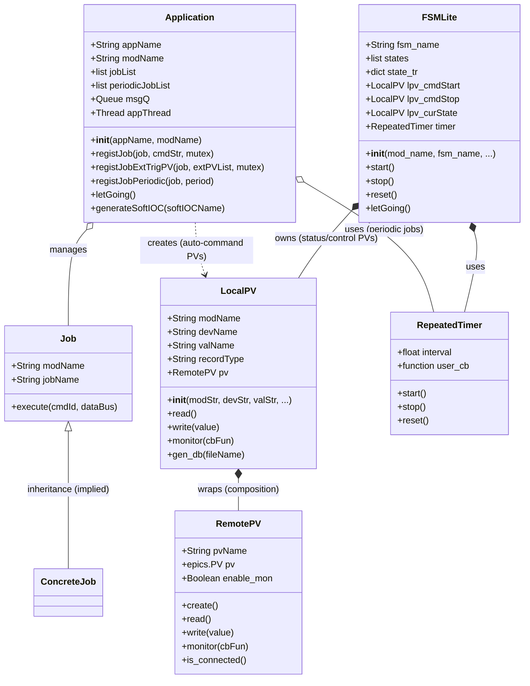

# ooEpics UML Class Diagram

```mermaid
classDiagram
    class Application {
        +String appName
        +String modName
        +list jobList
        +list periodicJobList
        +Queue msgQ
        +Thread appThread
        +__init__(appName, modName)
        +registJob(job, cmdStr, mutex)
        +registJobExtTrigPV(job, extPVList, mutex)        
        +registJobPeriodic(job, period)
        +letGoing()
        +generateSoftIOC(softIOCName)
    }

    class Job {
        +String modName
        +String jobName
        +execute(cmdId, dataBus)
    }

    class RemotePV {
        +String pvName
        +epics.PV pv
        +Boolean enable_mon
        +create()
        +read()
        +write(value)
        +monitor(cbFun)
        +is_connected()
    }

    class LocalPV {
        +String modName
        +String devName
        +String valName
        +String recordType
        +RemotePV pv
        +__init__(modStr, devStr, valStr, ...)
        +read()
        +write(value)
        +monitor(cbFun)
        +gen_db(fileName)
    }

    class FSMLite {
        +String fsm_name
        +list states
        +dict state_tr
        +LocalPV lpv_cmdStart
        +LocalPV lpv_cmdStop
        +LocalPV lpv_curState
        +RepeatedTimer timer
        +__init__(mod_name, fsm_name, ...)
        +start()
        +stop()
        +reset()
        +letGoing()
    }

    class RepeatedTimer {
        +float interval
        +function user_cb
        +start()
        +stop()
        +reset()
    }

    Application o-- Job : manages
    Application o-- RepeatedTimer : uses (periodic jobs)
    Application ..> LocalPV : creates (auto-command PVs)
    
    LocalPV *-- RemotePV : wraps (composition)
    
    FSMLite *-- LocalPV : owns (status/control PVs)
    FSMLite *-- RepeatedTimer : uses
    
    Job <|-- ConcreteJob : inheritance (implied)
```
